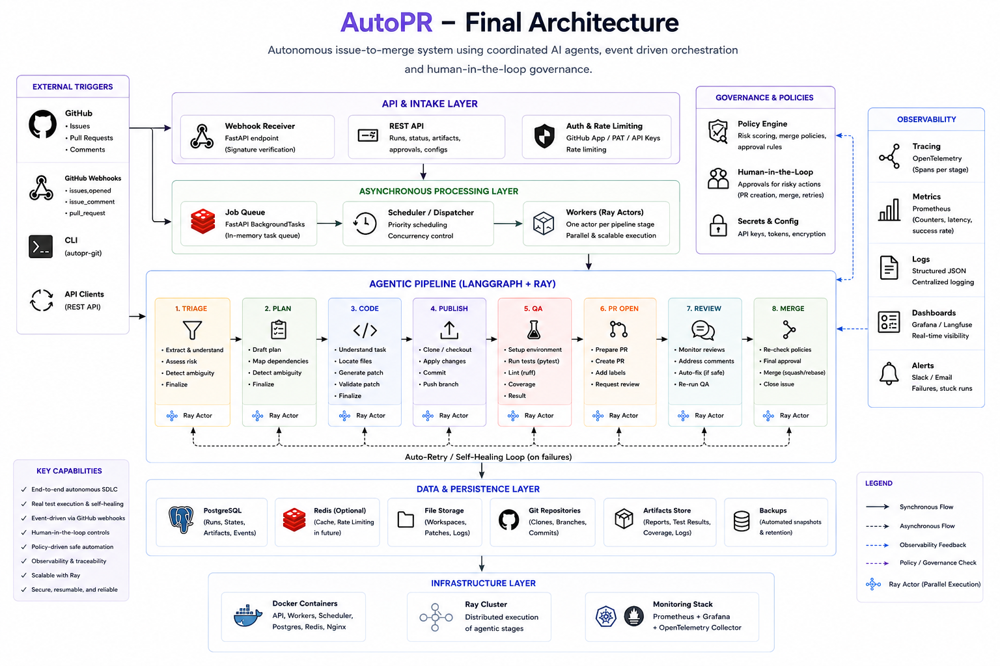

# AutoPR

An autonomous **issue-to-merge** system. A GitHub issue comes in; a pipeline of coordinated agents triages it, plans the work, writes the code, runs quality gates, opens a pull request, reviews it, and merges it — with policy gates that pull a human in when the risk is too high.

```bash
make run-api      # FastAPI intake on :8000
make run-worker   # queue worker that drains and dispatches runs
```

---

## Why This Exists

Most "AI writes a PR" tools are a single prompt wrapped in a script — one model call, no state, no recovery, no gates. AutoPR treats the issue-to-merge journey as a **stateful pipeline**. Every stage is an independent agent with a typed input/output contract, every run is a record advanced through a validated state machine, and every risky transition is checked against a policy before it proceeds. A stage can fail, block, or escalate to a human without losing the run.

---

## Architecture



A run flows top-down through five layers:

```
GitHub webhook  /  manual API call  /  CLI
        │
        ▼
API & Intake          ← FastAPI: verify, filter, enqueue
        │
        ▼
Async Job Queue       ← Redis list + processing list + dead-letter queue
        │
        ▼
Orchestrator          ← Coordinator advances a validated StateMachine
        │
        ├── per stage: PipelineStep → Ray actor → Agent (LangGraph)
        │
        ▼
Data & Persistence    ← SQLite: runs, run events, stage artifacts
```

**Layer resolution:** the API only *parses and enqueues* — it never runs a pipeline inline. The worker reserves a job from Redis, hands it to a `Coordinator`, and the coordinator walks the registered `PipelineStep`s for that run type. Each step dispatches its agent as a Ray remote actor, collects a typed `StageResult`, persists it, and asks the policy layer whether the run may transition.

---

## Pipeline

A run has one of two types, each a fixed sequence of stages:

| Run type | Stages |
|----------|--------|
| `ISSUE_TO_PR` | `triage → plan → code → qa → publish → pr_open` |
| `PR_TO_MERGE` | `review → merge` |

**Run state machine:**

```
RECEIVED → TRIAGED → PLANNED → CODING → QA_RUNNING → PR_OPENED
        → REVIEW_PENDING → READY_TO_MERGE → MERGED
```

Transitions are validated per run type — an illegal jump raises `InvalidStateTransitionError`. `QA_RUNNING` may loop back to `CODING` when checks fail.

**Stage walkthrough:**

```
triage    ← LLM extracts a TaskSpec, scores risk, flags ambiguity
plan      ← LLM drafts ordered steps, maps dependencies, detects open questions
code      ← LLM generates full file contents for the selected step
qa        ← sandbox runs tests · coverage · lint · security in parallel
publish   ← writes files to a git workspace, commits, pushes the head branch
pr_open   ← opens the pull request (policy-gated by QA result)
review    ← LLM evaluates the PR; merge policy decides READY_TO_MERGE
merge     ← merges via the GitHub API (policy- and approval-gated)
```

> `publish`, `pr_open`, and `merge` only touch GitHub when `AUTOPR_EXECUTE_REMOTE_ACTIONS=true`. Otherwise they return `needs_review` and stop short of any remote write.

---

## Agents

Each agent is a [LangGraph](https://github.com/langchain-ai/langgraph) graph of nodes that calls an LLM, parses the response against a Pydantic schema, and emits a typed contract from `core/contracts/`.

### ✅ Implemented

| Agent | Graph nodes | Emits |
|-------|-------------|-------|
| **Triage** | `extract_task → assess_risk → detect_ambiguity → finalize` | `TriageResult` |
| **Plan** | `draft_plan → map_dependencies → detect_ambiguity → finalize` | `PlanOutput` |
| **Code** | `understand_task → locate_files → generate_patch → validate_patch → finalize` | `CodeOutput` |
| **QA** | `evaluate_inputs → run_checks → finalize` | `QAOutput` |
| **PR** | `prepare_request → open_pr → finalize` | `PROpenOutput` |
| **Review** | `evaluate_review → finalize` | `ReviewOutput` |

Non-agent steps — **Publish** (git operations) and **Merge** (GitHub API) — run as plain `PipelineStep`s without an LLM.

### 🔲 Planned (placeholders exist; no implementation)

- `pipelines/` — per-stage pipeline modules (empty package)
- `infra/ray/{cluster,scheduler,tasks}.py` — Ray cluster lifecycle and scheduling (empty)

---

## Infrastructure

### LLM backend

| Provider | Notes |
|----------|-------|
| Ollama-compatible HTTP | Default — `deepseek-coder-v2:latest` over an Ollama `/api/generate` endpoint |

Switch via env, no code change:

```bash
export AUTOPR_LLM_ENDPOINT=http://localhost:11434
export AUTOPR_LLM_MODEL=deepseek-coder-v2:latest
```

### Job queue — `infra/redis`

A Redis-backed queue (`RedisWebhookQueue`) with three keys: the pending list, a
processing list (for crash-safe reservation via `BRPOPLPUSH`), and a
dead-letter queue. A message is retried until `AUTOPR_WEBHOOK_MAX_ATTEMPTS`,
then moved to the DLQ.

### Quality gates — `infra/qa`

QA copies the change set into a sandboxed temp workspace and runs four checks as parallel Ray tasks:

| Check | Tool |
|-------|------|
| Tests | `pytest` |
| Coverage | `coverage` (threshold default 80%) |
| Lint | `ruff` |
| Security | `bandit` |

Results aggregate into a `QAOutput` whose status (`ok` / `needs_review` / `blocked`) gates whether the PR may open.

### Persistence — `infra/storage`

SQLite (`data/autopr.sqlite3` by default), schema created lazily. Three tables:
`runs`, run `events`, and stage `artifacts`. Exposed via `GET /runs/{run_id}`.

### Containers — `docker`

`docker/docker-compose.yml` runs `redis`, `api`, and `worker`. The worker also
exposes the Ray dashboard on port `8265`.

---

## Setup

**Requirements:** Python 3.11+ · Redis · an Ollama-compatible LLM endpoint

```bash
git clone https://github.com/nk-droid/autopr
cd autopr

python -m venv .venv
source .venv/bin/activate
pip install -e ".[dev,llm]"
```

Create a `.env` (see `.env.example`):

```env
GITHUB_TOKEN=ghp_...                 # required for PR/merge and private reads
GITHUB_WEBHOOK_SECRET=...            # webhook signature secret
AUTOPR_REDIS_URL=redis://localhost:6379/0
AUTOPR_LLM_ENDPOINT=http://localhost:11434
AUTOPR_EXECUTE_REMOTE_ACTIONS=false  # set true to write to GitHub
```

---

## Running

### Local

```bash
make run-api       # uvicorn apps.api.main:app on :8000
make run-worker    # python apps/worker/main.py — drains the Redis queue
make test          # pytest
make lint          # compileall
```

Both the API and worker need a reachable Redis instance.

### Docker

```bash
docker compose -f docker/docker-compose.yml up --build
```

### CLI — `autopr-git`

A scaffold for local git and GitHub API operations (`apps/cli/github_ops.py`):

| Command | Effect |
|---------|--------|
| `status`, `checkout`, `commit`, `push`, `pull`, `branch-delete` | Local git operations on `--repo-path` |
| `issues-list`, `issue-pick`, `issue-details` | Read GitHub issues |
| `pr-create` | Open a pull request |

```bash
autopr-git --repo-path /path/to/repo checkout feature/my-branch --create
autopr-git issue-details --issue https://github.com/owner/repo/issues/123
autopr-git pr-create --repo owner/repo --title "My PR" --head feature/my-branch --base main
```

### Tests

```bash
pytest -q
```

Unit, integration, and e2e tests live under `tests/`. CI runs lint and tests
(`.github/workflows/`).

---

## Configuration

| Variable | Purpose | Default |
|----------|---------|---------|
| `GITHUB_TOKEN` | GitHub API auth | — |
| `GITHUB_WEBHOOK_SECRET` | Webhook signature secret | — |
| `AUTOPR_REDIS_URL` | Redis connection URL | `redis://localhost:6379/0` |
| `AUTOPR_DB_PATH` | SQLite database path | `data/autopr.sqlite3` |
| `AUTOPR_LLM_ENDPOINT` | LLM HTTP endpoint | Ollama endpoint |
| `AUTOPR_LLM_MODEL` | LLM model name | `deepseek-coder-v2:latest` |
| `AUTOPR_EXECUTE_REMOTE_ACTIONS` | Allow publish / PR / merge writes to GitHub | `false` |
| `AUTOPR_WEBHOOK_RUN_ON_ISSUES` | Start runs from `issues` events | `true` |
| `AUTOPR_WEBHOOK_MERGE_ON_APPROVAL` | Start merge runs from PR approvals | `false` |
| `AUTOPR_WEBHOOK_MAX_ATTEMPTS` | Queue retries before dead-letter | `5` |

Optional per-run context keys: `repo_path` / `local_repo_path`,
`repository_clone_url`, `head_branch`, `base_branch`, `commit_message`,
`git_remote`, `git_author_name`, `git_author_email`.

---

## Project Structure

```
autopr/
├── apps/
│   ├── api/             FastAPI service
│   │   ├── main.py
│   │   ├── routes/      webhooks.py, runs.py, internal.py
│   │   └── schemas/     request/response Pydantic models
│   ├── worker/          main.py — Redis queue consumer
│   └── cli/             github_ops.py — autopr-git command
├── core/
│   ├── agents/          triage, plan, code, qa, pr, review
│   │                    (each: graph.py, nodes.py, runner.py, schema.py)
│   ├── contracts/       Pydantic stage contracts + enums
│   ├── orchestrator/    coordinator, state_machine, transitions, steps/
│   └── policies/        merge_policy.py, risk_scoring.py
├── infra/
│   ├── github/          API client, auth, issues, webhook handler, models
│   ├── llm/             Ollama HTTP client, prompt + output parser
│   ├── ray/             actors.py (workers), jobs/qa.py; cluster/scheduler (stub)
│   ├── qa/              sandbox + tests/coverage/lint/security runners, aggregator
│   ├── redis/           webhook_queue.py — queue, processing list, DLQ
│   ├── repo_worker/     git_utils.py, sandbox.py
│   └── storage/         db.py (SQLite), artifacts.py, models.py
├── observability/       logging, metrics (no-op), tracing
├── configs/             settings.py, policies.yaml, prompts.yaml
├── docker/              api/worker Dockerfiles, docker-compose.yml
├── docs/                architecture.png
├── pipelines/           reserved per-stage pipeline modules (empty)
├── scripts/             replay_run.py, seed_data.py, start_local.sh
└── tests/               unit, integration, e2e
```

---

## Known Limitations

| Issue | Detail |
|-------|--------|
| Webhook signature verification not wired | `_verify_signature` is implemented in `webhook_handler.py` but not invoked in the request path |
| `pipelines/` is empty | Reserved package; orchestration currently lives entirely in `core/orchestrator` |
| Ray cluster/scheduler stubs | `infra/ray/cluster.py`, `scheduler.py`, `tasks.py` are empty placeholders |
| Observability is minimal | `metrics.record_metric` is a no-op; `tracing.trace_event` builds a payload but isn't consumed |
| `/internal/agent-result` is a stub | Returns a static `{"status": "ok"}` |
| Issue-comment triggers inactive | `/autopr run` and `/autopr merge` comment regexes exist; the handler branch is commented out |

---

## Roadmap

- [ ] Wire `_verify_signature` into the webhook intake path
- [ ] Implement the `pipelines/` per-stage modules
- [ ] Ray cluster lifecycle + scheduler (`infra/ray/`)
- [ ] Connect an observability backend (metrics + tracing)
- [ ] Activate `/autopr run` and `/autopr merge` issue-comment commands
- [ ] Additional LLM providers (Anthropic dependency is present but unused)

---

## Stack

- Python 3.11+
- FastAPI + Uvicorn (intake API)
- Ray (`ray[default]`) — distributed stage execution
- LangGraph + LangChain (`langchain`, `langgraph`, `langchain-classic`) — agent graphs
- Pydantic v2 — contracts and validation
- Redis (`redis`) — webhook job queue
- SQLite — run/event/artifact persistence
- pytest · ruff · coverage · bandit — QA gates and CI

**External services**

- GitHub — issues, pull requests, webhooks
- Ollama — default LLM backend (`deepseek-coder-v2`)
- Redis — queue broker
